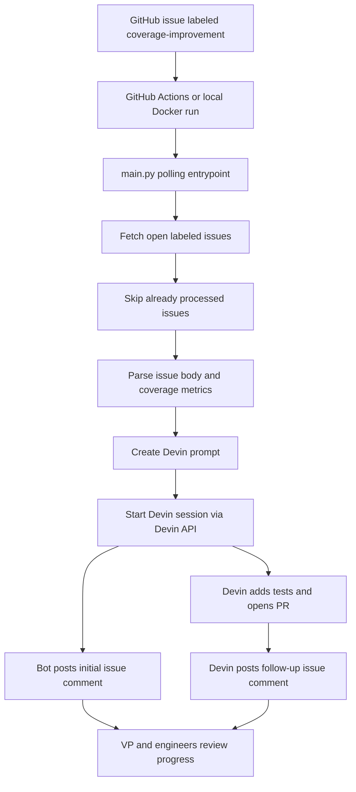

# Test Coverage Bot

Automation that turns labeled GitHub issues into Devin sessions that create focused test coverage pull requests.

Uses GitHub issues as the work queue, Devin as the autonomous coding agent, and GitHub comments/artifacts as lightweight observability.

## What problem does this solve?

Low test coverage creates release risk and slows engineering velocity. Improving coverage can be time-consuming and repetitive.

This bot turns that backlog into an actionable workflow:

1. An engineer creates a GitHub issue describing a coverage gap.
2. The issue is labeled `coverage-improvement`.
3. The workflow polls labeled issues every 10 minutes while it is running.
4. The bot starts a Devin session with the issue context, target file, coverage data, and acceptance criteria.
5. Devin adds tests, runs relevant commands, opens a PR, and posts a follow-up issue comment with the PR link, updated coverage, tests run, and caveats.

For demo simplicity, this uses polling instead of GitHub webhook infrastructure. The label is still the product trigger; the workflow discovers labeled issues on a schedule.

## How it works



## Architecture decisions

- **Polling over webhooks:** Easier to demo and debug. No public webhook endpoint or GitHub App setup is required.
- **GitHub issues as the queue:** Engineers can describe risk, target files, and acceptance criteria in a familiar place.
- **Devin as the worker:** The bot does not try to write tests itself. It delegates repository exploration, code changes, test execution, and PR creation to Devin.
- **Small Python modules:** The code is split by responsibility so future extensions are straightforward.
- **Lightweight observability:** GitHub comments, JSONL logs, JSON results, and Markdown reports show what happened.

## Project structure

```text
main.py                         # Root entrypoint for local, Docker, and GitHub Actions
src/test_coverage_bot/
  application.py                # Orchestrates polling, duplicate checks, Devin, comments, outputs
  cli.py                        # CLI args, env loading, polling loop
  config.py                     # Runtime configuration
  devin_client.py               # Devin API client
  github_client.py              # GitHub issue/comment API client
  issue_parser.py               # Issue labels, target file, coverage metrics
  prompting.py                  # Devin prompt and issue comment text
  storage.py                    # State, logs, JSON results, Markdown report
  models.py                     # Domain models
```

## Issue format

The bot works best when issues include coverage data and acceptance criteria:

```md
Coverage data:

- File: `path/to/file.py`
- Lines: **12.50%** (`5 / 40`)
- Branches: **0.00%** (`0 / 10`)
- Functions: **20.00%** (`1 / 5`)

Why this matters:

Explain the production or engineering risk.

Acceptance criteria:

- Add focused tests for the important behavior.
- Run the relevant test or coverage command.
- Open a PR and comment with coverage before/after.
```

## Environment

Copy the example env file:

```bash
cp .env.example .env.local
```

Set these for live runs:

- **`DEVIN_API_KEY`**: Devin API key.
- **`DEVIN_ORG_ID`**: Devin organization ID.
- **`GITHUB_TOKEN`**: Token that can read issues and write issue comments.
- **`GITHUB_REPOSITORY`**: Target repo, for example `arjun-krishna1/superset`.

Optional:

- **`DEVIN_CREATE_AS_USER_ID`**: Devin user attribution.
- **`ISSUE_LABEL`**: Defaults to `coverage-improvement`.
- **`POLL_INTERVAL_SECONDS`**: Defaults to `600`.

## Run locally

### 1. Build the image

```bash
docker build -t test-coverage-bot .
```

### 2. Dry-run with the included fixture

```bash
docker run --rm \
  -v "$PWD/outputs:/app/outputs" \
  test-coverage-bot \
    --repo apache/superset \
    --fixture examples/github-issues-coverage-improvement.fixture.json \
    --dry-run \
    --once \
    --output-dir outputs
```

### 3. Live one-shot run

```bash
docker run --rm \
  --env-file .env.local \
  -v "$PWD/outputs:/app/outputs" \
  test-coverage-bot \
    --label coverage-improvement \
    --once \
    --output-dir outputs \
    --state-file outputs/processed-issues.json
```

### 4. Bounded polling run

```bash
docker run --rm \
  --env-file .env.local \
  -v "$PWD/outputs:/app/outputs" \
  test-coverage-bot \
    --label coverage-improvement \
    --max-cycles 6 \
    --output-dir outputs \
    --state-file outputs/processed-issues.json
```

With the default 600-second interval, `--max-cycles 6` polls for about one hour.

## Run with GitHub Actions

This repo includes `.github/workflows/coverage-improvement.yml`.

Setup:

1. Push this repo to GitHub.
2. Add repository secrets:
   - `DEVIN_API_KEY`
   - `DEVIN_ORG_ID`
   - Optional: `DEVIN_CREATE_AS_USER_ID`
3. Ensure the workflow has:
   - `issues: write`
   - `contents: read`
4. Create issues with coverage context.
5. Add the `coverage-improvement` label.
6. Run the workflow manually or wait for the scheduled run.

The workflow builds the Docker image, polls every 10 minutes while running, starts Devin sessions, comments on issues, and uploads `outputs/` as an artifact.

## Observable outputs

- **Initial issue comment:** Bot posts Devin session URL, target file, and coverage before.
- **Follow-up issue comment:** Devin is instructed to post PR URL, tests run, updated coverage, and caveats.
- **`outputs/events.jsonl`:** Poll and processing events.
- **`outputs/devin-remediation-results.json`:** Structured run results.
- **`outputs/devin-remediation-report.md`:** Human-readable run summary.
- **`outputs/processed-issues.json`:** State file that prevents duplicate Devin sessions.

## Why Devin is uniquely suited

A normal automation can find labeled issues and call APIs. It cannot reliably inspect an unfamiliar codebase, understand existing test patterns, choose the right testing approach, edit code, run tests, debug failures, and open a reviewable PR.

Devin is the core primitive because it turns a loosely specified coverage issue into an autonomous engineering task:

- **Repository understanding:** Finds relevant code and nearby tests.
- **Code generation:** Adds focused tests instead of broad refactors.
- **Iteration:** Runs commands, observes failures, and fixes them.
- **Review readiness:** Opens PRs with summaries, tests run, and issue links.
- **Communication:** Posts progress and completion updates back to GitHub.

## Next steps for a customer engagement

- **Browser QA:** Use Playwright/browser-based agents for user workflows that unit tests cannot cover well.
- **Dashboard:** Aggregate issues, PRs, coverage before/after, and time-to-remediation.
- **Policy controls:** Add allowlists, PR size limits, and reviewer assignment rules.
