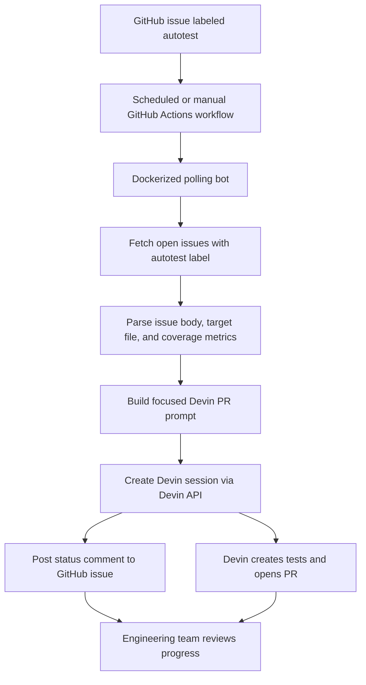

# Test Coverage Bot

Polling automation that turns open GitHub issues labeled `autotest` into Devin sessions that create focused test-coverage pull requests.

This project is a simple end-to-end demo for adopting Devin in an engineering workflow: engineers file coverage-gap issues, add the `autotest` label, and the bot periodically asks Devin to remediate the issue with a reviewable PR.

## Problem

Low test coverage creates production risk and slows engineering teams down. Coverage gaps are often known, but manually turning each gap into high-quality tests is tedious and easy to postpone.

This bot converts that backlog into an automated workflow:

1. Engineers create GitHub issues for important coverage gaps.
2. They label selected issues `autotest`.
3. The workflow polls for labeled issues every 10 minutes while it is running.
4. The bot creates a Devin session with the issue context, target file, coverage data, and acceptance criteria.
5. Devin investigates the repository, adds focused tests, runs relevant commands, and opens a pull request when possible.
6. The bot posts a GitHub issue comment and writes lightweight output artifacts so the team can track progress.

## Architecture



## What the bot does

- **Polls GitHub:** Finds open issues in `GITHUB_REPOSITORY` with the configured label, defaulting to `autotest`.
- **Extracts coverage context:** Reads issue title, body, repository, target file, and coverage numbers from the issue body.
- **Starts Devin work:** Creates a Devin session with instructions to add focused tests and open a PR.
- **Avoids duplicate sessions:** Tracks processed issues in `outputs/processed-issues.json` and checks for an existing bot comment marker.
- **Posts progress:** Adds a lightweight issue comment showing the Devin session, target file, and coverage before/after status.
- **Writes artifacts:** Stores logs and summaries under `outputs/`.

## Issue format

The bot works best when the issue body includes coverage data in this format:

```md
Coverage data:

- File: `path/to/file.py`
- Lines: **12.50%** (`5 / 40`)
- Branches: **0.00%** (`0 / 10`)
- Functions: **20.00%** (`1 / 5`)

Why this matters:

Explain the business or engineering risk.

Acceptance criteria:

- Cover the important behavior.
- Run the relevant test command.
- Open a PR with coverage before and after when available.
```

## Requirements

- Docker
- Devin API credentials:
  - `DEVIN_API_KEY`
  - `DEVIN_ORG_ID`
- GitHub token with permission to read issues and write issue comments:
  - `GITHUB_TOKEN`

## Environment variables

Copy `.env.example` to `.env.local` and fill in the values:

```bash
cp .env.example .env.local
```

Required for live runs:

- **`DEVIN_API_KEY`**: Devin API key.
- **`DEVIN_ORG_ID`**: Devin organization ID.
- **`GITHUB_TOKEN`**: GitHub token with issue read/comment permissions.
- **`GITHUB_REPOSITORY`**: Repository to poll, for example `apache/superset`.

Optional:

- **`DEVIN_CREATE_AS_USER_ID`**: Devin user attribution for created sessions.
- **`AUTOTEST_LABEL`**: Label to poll for. Defaults to `autotest`.
- **`POLL_INTERVAL_SECONDS`**: Poll interval. Defaults to `600`.
- **`DEVIN_API_BASE_URL`**: Defaults to `https://api.devin.ai/v3`.
- **`GITHUB_API_BASE_URL`**: Defaults to `https://api.github.com`.

## Local dry run

Build the image:

```bash
docker build -t test-coverage-bot .
```

Run a one-shot dry-run simulation with the included issue-list fixture:

```bash
docker run --rm \
  -v "$PWD/outputs:/app/outputs" \
  test-coverage-bot \
    --repo apache/superset \
    --fixture examples/github-issues-autotest.fixture.json \
    --dry-run \
    --once \
    --output-dir outputs
```

Inspect generated outputs:

```bash
cat outputs/devin-remediation-report.md
cat outputs/events.jsonl
```

## Local Docker Compose dry run

Create a local env file:

```bash
cp .env.example .env.local
```

Then run:

```bash
docker compose up --build
```

The default Compose command runs one dry-run poll using `examples/github-issues-autotest.fixture.json`.

## Live polling run

Run the bot against GitHub:

```bash
docker run --rm \
  --env-file .env.local \
  -v "$PWD/outputs:/app/outputs" \
  test-coverage-bot \
    --repo "$GITHUB_REPOSITORY" \
    --label "$AUTOTEST_LABEL" \
    --output-dir outputs \
    --state-file outputs/processed-issues.json
```

The bot polls every `POLL_INTERVAL_SECONDS` seconds until stopped.

For a bounded demo run, use `--max-cycles`:

```bash
docker run --rm \
  --env-file .env.local \
  -v "$PWD/outputs:/app/outputs" \
  test-coverage-bot \
    --repo "$GITHUB_REPOSITORY" \
    --label "$AUTOTEST_LABEL" \
    --max-cycles 6 \
    --output-dir outputs \
    --state-file outputs/processed-issues.json
```

With the default interval of 600 seconds, `--max-cycles 6` runs for about one hour and polls every 10 minutes.

## GitHub Actions demo workflow

This repo includes `.github/workflows/autotest.yml`.

The workflow:

1. Runs on a schedule or manually through `workflow_dispatch`.
2. Builds the Docker image.
3. Runs the bot for up to 6 polling cycles.
4. Polls every 10 minutes while the workflow is running.
5. Creates Devin sessions for newly discovered `autotest` issues.
6. Uploads `outputs/` as an artifact.

To use it:

1. Push this repo to GitHub.
2. Add repository secrets:
   - `DEVIN_API_KEY`
   - `DEVIN_ORG_ID`
   - Optional: `DEVIN_CREATE_AS_USER_ID`
3. Create or choose a GitHub issue in the repository.
4. Add coverage context and acceptance criteria to the issue body.
5. Add the `autotest` label.
6. Run the workflow manually or wait for the next scheduled run.

## Observability

The simplest way to tell whether the automation is working:

- **Issue comments:** The bot comments when Devin automation starts.
- **Coverage before:** Parsed from the issue body and shown in the comment/report.
- **Coverage after:** Marked pending until Devin's PR reports updated coverage.
- **Local logs:** `outputs/events.jsonl` records poll starts, skipped issues, session creation, and completion.
- **Summary report:** `outputs/devin-remediation-report.md` summarizes issue, target file, Devin session, status, coverage before, and coverage after.
- **Structured results:** `outputs/devin-remediation-results.json` stores machine-readable results.

## Why Devin is the core primitive

A normal script can find labeled issues and post comments. Devin is what makes the workflow valuable: it can inspect an unfamiliar repository, understand nearby test patterns, write targeted tests, run commands, iterate on failures, and open a PR with technical context.

That turns a passive coverage backlog into active remediation work without requiring engineers to manually triage every gap.

## Future extensions

- Add a follow-up workflow that reads PR coverage output and updates the original issue with coverage after.
- Add Playwright or browser-based QA issues for workflows that are hard to cover with unit tests.
- Add dashboard-style reporting across all `autotest` issues.
- Add routing logic for different labels such as `autotest-frontend`, `autotest-backend`, or `autotest-e2e`.
